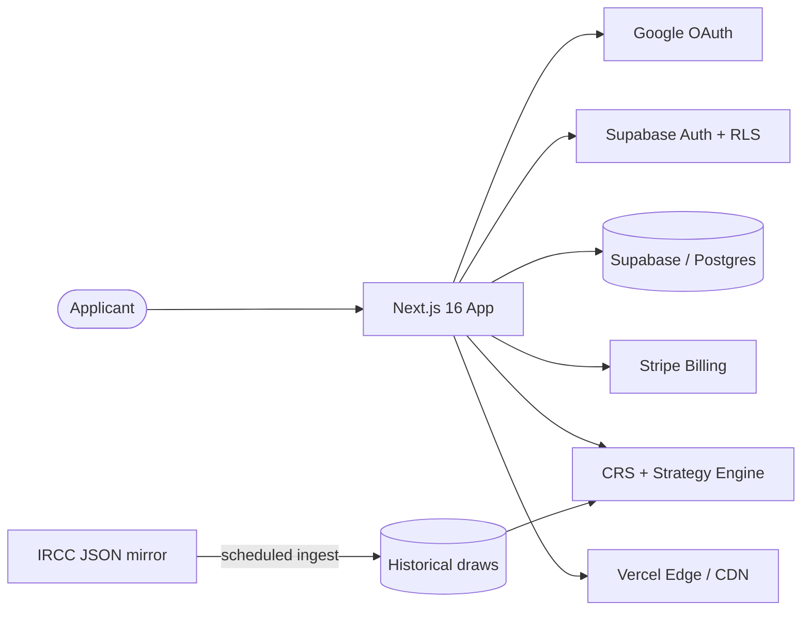

<h1 align="center">PRAVÉ</h1>

  <strong>Express Entry CRS optimization tool.</strong> 
  Calculate, simulate, and improve your Canadian permanent-residency score.

  
  

  
  
  
  
  
  

---

  <em>↓ 
 ↓</em>

## What it is

PRAVÉ helps Canadian Express Entry candidates understand and improve their **Comprehensive Ranking System (CRS)** score. It calculates a score against the current official rules, simulates outcomes against historical draws, and surfaces a personalized path to the next cutoff — including provincial nominee (PNP) options.

It's built to stay accurate as IRCC rules change, and to comply with Canadian immigration-advice regulations (CICC).

## Features

- **CRS calculator** aligned with current IRCC rules (including the 2025 removal of job-offer points).
- **Draw simulator** backed by **400+ historical draws**, so candidates can see where they'd land.
- **Category-based draw matching** across all official draw categories.
- **PNP matching across 11 provinces** to surface nomination pathways.
- **FSW 67-point eligibility grid** for upfront program-eligibility checks.
- **Personalized strategy engine** that maps a candidate's profile to the highest-leverage score improvements.

## Architecture

A scheduled **data pipeline** ingests official IRCC draw data and feeds the **CRS and strategy engine**, which scores profiles and matches them against draw categories and provincial programs. Row-level security isolates each user's data at the database layer.

## Engineering highlights

- **Resilient data pipeline.** The original source (canada.ca) is bot-protected, so ingestion was rebuilt to pull from a structured **IRCC JSON mirror** — reliable, parseable, and resistant to layout changes.
- **OAuth with hard edge cases solved.** Google OAuth as primary auth, plus handling for the **Safari iOS PKCE flow** and detection of **in-app browsers** (Gmail / webviews) with automatic redirect to a compliant flow.
- **Row-level security** on sensitive tables so users can only ever read their own records.
- **Rules-accurate CRS engine** maintained against official IRCC point tables as policy changes.
- **Stripe subscription lifecycle** wired end to end: checkout, webhooks, billing management.

## Status

🔒 **Source is private** — PRAVÉ is a live product with active billing. This repository is a public showcase of the architecture and engineering. Try the real thing at **[pravepath.ca](https://pravepath.ca)**.

---

  Built by <a href="https://omarserrano.ca">Omar Serrano</a> ·
  <a href="https://www.linkedin.com/in/omar-serrano-b40b01216/">LinkedIn</a>

